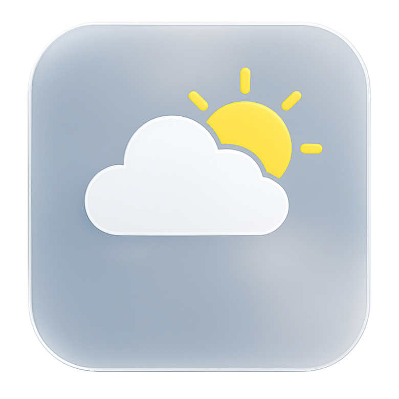
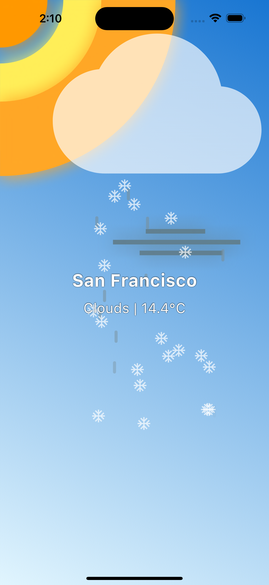
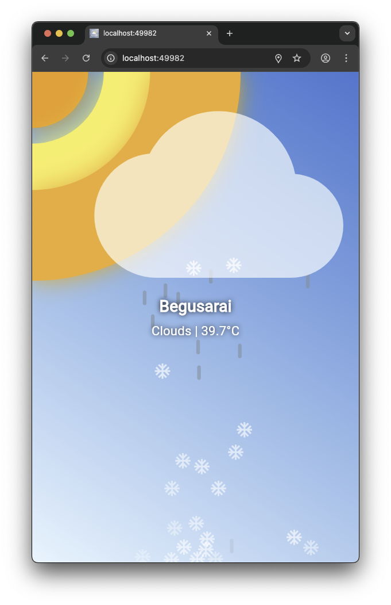

# Weatherify

**Not just any weather app — it's the weather app you need.**

Weatherify is a sleek, fast, and reliable weather application that delivers real-time, accurate weather updates in a beautiful and intuitive interface. Designed with user experience in mind, Weatherify brings the forecast to your fingertips, whether you're on Android, iOS, or the web.

## Table of Contents

- [Features](#features)
- [Releases](#releases)
- [Platforms Supported](#platforms-supported)
- [Getting Started](#getting-started)
- [Contributing](#contributing)
- [License](#license)
- [Author](#author)

## Screenshots

| Platform | Screenshot |
|----------|------------|
| iOS      |  |
| Android  |  |
| Web      |  |

---

## Features

- [x] **Real-time Weather Forecasts**
- [x] **Animated Weather Backgrounds**
- [x] **Responsive Web Support**
- [x] **Android Support**
- [x] **iOS Support**
- [x] **Location-based Weather Detection**
- [x] **Beautiful and Minimal UI**
- [x] **Optimized for Performance**
- [ ] **Home Screen Widgets**

---

## Releases

Demos:

1. [Andoid APK](https://github.com/mantreshkhurana/weatherify/releases/download/1.0.0/weatherify-v1.0.0-1.apk)
2. [Web Demo](https://weatherify-mantresh.web.app/)

Checkout the latest releases of Weatherify:
[Releases](https://github.com/mantreshkhurana/weatherify/releases)

| Version | Date       | Description                          |
|---------|------------|--------------------------------------|
| [1.0.0](https://github.com/mantreshkhurana/weatherify/releases/tag/1.0.0)   | 23.07.2025 | Initial release with core features |

## Platforms Supported

| Platform | Status      |
|----------|-------------|
| Android  | ✅ Supported |
| iOS      | ✅ Supported |
| Web      | ✅ Supported |

## Getting Started

To set up Weatherify for development, follow these steps:

### 1. Configure App Details

```bash
flutter pub global run rename setAppName --targets ios,android --value "Weatherify"
flutter pub global run rename setBundleId --targets android --value "com.mantresh.weatherify"
```

2.Install Dependencies

```bash
flutter pub get
```

3.Generate App Icons
To change app icon edit `pubspec.yaml` file and replace the `assets` section with your own icons. Then run the following command to generate the app icons:
replace the `image_path` with your own icon path.

```yaml
icons_launcher:
  image_path: "assets/images/logo.png"
  platforms:
    android:
      enable: true
    ios:
      enable: true
```

Then run the following command to generate the app icons:

```bash
dart run icons_launcher:create
```

4.Set Up Environment Variables

Create a .env file in the root directory of the project and add your OpenWeather API key:
Get your API key from [OpenWeather](https://openweathermap.org/api).

```.env
OPEN_WEATHER_API_KEY="your_actual_api_key_here"
```

Note: Never commit your .env file to version control. Add .env to your .gitignore.

## Contributing

We welcome contributions to Weatherify! If you have suggestions, bug reports, or feature requests,
please open an issue or submit a pull request. For major changes, please open an issue first to discuss what you would like to change.

## License

Weatherify is open-source software licensed under the [MIT License](LICENSE).

## Author

Weatherify is developed and maintained by [Mantresh Khurana](https://github.com/mantreshkhurana)
